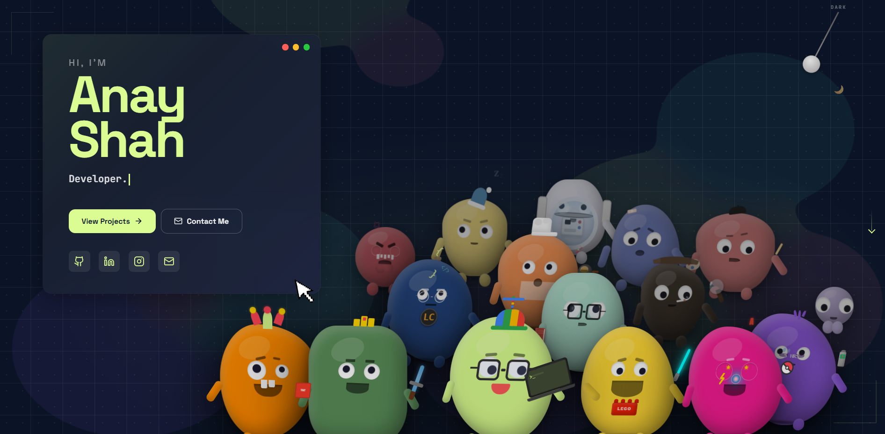

  

> ### 👾 ABOUT ME
> **Building high-impact interfaces with React & Next.js, manipulating 3D space with Three.js & GSAP, and engineering robotics software for the Mars Rover.** > Welcome to my digital workshop.

---

## 🌐 PORTFOLIO • [anayshah13.vercel.app](https://anayshah13.vercel.app)

  

---

## 🛠️ TECH ARSENAL

### 🟨 FRONTEND & ANIMATION

  
  
  
  
  
  
  

### 🟪 LANGUAGES, DATA & ML

  
  
  
  
  
  

### 🟦 SYSTEMS & HARDWARE

  
  
  
  
  
  

---

## 🏆 TROPHY ROOM & COMMAND POSTS

> **🎖️ TOP ACHIEVEMENTS**
> * 🥉 **3rd Place** — Rift Rewind Hackathon (AWS x Riot Games)
> * 🥉 **2nd Runner-Up** — SPIT Frontend Hackathon
> * 🏅 **Top 10 Finisher** — SPIT CodeHunt & CodeBusters
> * 🧠 **280+** DSA Problems conquered on LeetCode & Codeforces

> **🚀 COMMAND POSTS & ORGS**
> * 🪐 **DJS Antariksh (Mars Rover Team):** Robotics Software & UI Developer
> * 💻 **DJS CodeStars:** Technical Co-Com & Contest Problem Setter
> * 🌐 **DJCSI:** Technical Web Co-Com, maintaining official digital ecosystems

---

## ⚡ GITHUB HUSTLE

  
  

---

## 🧊 CONTRIBUTION GRID

  

  

---

## 📡 CONNECT

  
  
  
  
  

  

